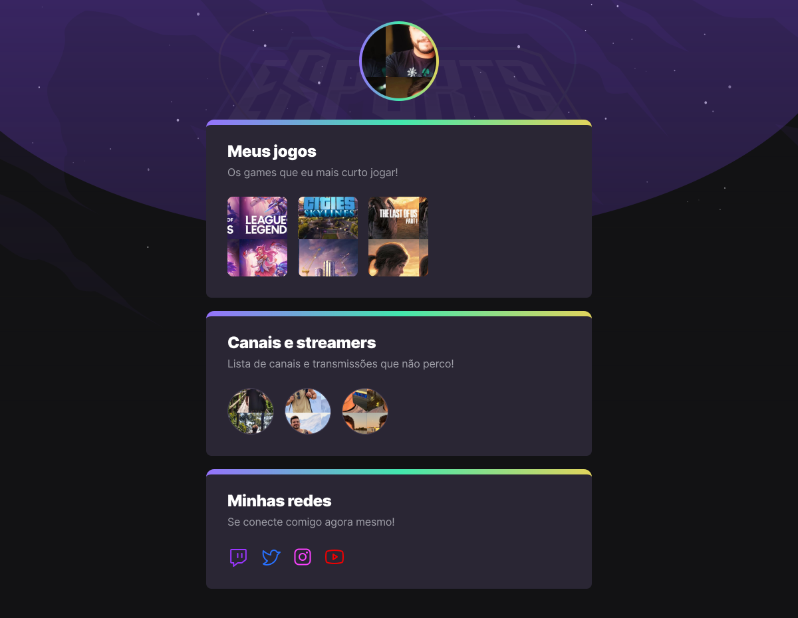

<h1 align="center">
    
</h1>

  <a href="#-project">Projeto</a>&nbsp;&nbsp;&nbsp;|&nbsp;&nbsp;&nbsp;
  <a href="#rocket-Technologies">Tecnologias</a>&nbsp;&nbsp;&nbsp;|&nbsp;&nbsp;&nbsp;
  <a href="#-layout">Layout</a>

## Projeto

Projeto desenvolvido durante o Next Level Week eSports , na trilha Explorer, que foi realizado pela Rocketseat.

 

<h1 align="center">
    
</h1>

## Tecnologias

Esse projeto foi desenvolvido com as seguintes tecnologias:

- HTML
- CSS
- Git / GitHub

## Layout

Acesse para visualizar o arquivo do [Figma](https://www.figma.com/file/aSoIWMun9GlLKqeDrDkiQr/NLW-eSports-Community).

